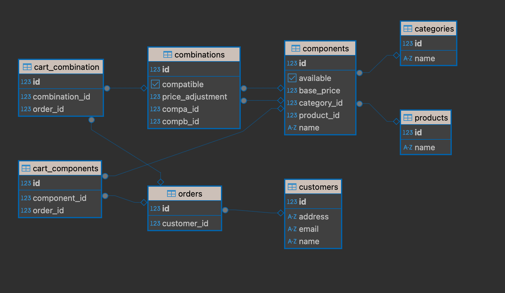

# Bicycle Shop Backend
It is a project which provides the server side of a bicycle shop website. It uses a monolith approach since it 
supports a few features such us, configuration for products, components, categories and the implementation of a cart,
the orders and customers information. Technology used for these is Springboot framework which is recommended for JVM
REST API (Application Programming Interface REpresentational State Transfer) based applications mainly used for 
microservice implementations. In this case, as it is a growing early-stage application, it is chosen to use a 
monolith app to simplify the configuration but with and architecture that could be migrated to microservice with 
these technology when the complexity demands it. The programming language used is Kotlin, it's JVM (Java Virtual 
Machine) based that has the advantages of a Java application with a modern and easier to develop language.
## Data model
It is a relational database, based in Postgres which allows the efficiency in memory of the system, maintain data 
integrity and scalability, that has the 
following 
structure:
- Product: Object which reflects the every selling item in the shop, nowadays, Marcus only needs bicycles.
- Components: It reflects every part of the product customisation.
- Categories: It groups every component in a family of components. 
- Combination: Configures the compatibility and price adjustments of a combination of components that could be set.
- CartCombination: Relation between a combination added to an order.
- CartComponent: Relation between a component added to an order.
- Customer: Information fo a person which orders a product
- Order: Relation of every configured product added to a cart and a customer willing to shop.

Relational databases are not recommended in high performance applications which includes complex queries and has 
difficulties to change the structure but in this case, the shop won't need cutting edge performance, there are few 
relational tables and its structure has flexibility to configure every product and component combination.

## Main user actions
The actions implemented in the backend are the CRUD (Create, Read, Update and Delete) based API of 
every object 
described below. The implementation of this functionality it is based in an abstraction of the controller, service, 
mapper and exceptions layers and for every domain it has its implementation to centralise the functionality and 
solve future errors at once. 
The 
detail of the 
user actions in the UI
will 
be described in the frontend project.

## Product Page
On the one hand, the components and combinations set in the database will be delivered depending on the product 
selected.
On the other hand, the calculation of the final cost will be the addition of every price of the components and the 
price adjustments of 
the combinations object that will increase or decrease of the price.

## Add to cart action
The backend part of this action involves the insert in database of an order with every CartCombination and 
CartComponents set.

## Administrative workflows
These workflows involve the CRUD operation of the objects Product, Category, Component, Combination.

## Next steps
- Implement security to the administrative workflows for Marcus and a future employee to log in access the 
  configuration 
  features. It could be implemented LDAP server which the administrator of the system will sign in every 
  administrative user that can access this part.
- Stock manage: Implement the data model and user actions involved in the manage of the number of components 
  available in the shop, and the automated workflows of consuming and addition of components.
- Orders view: Implement a detailed orders site which will show the order states, and could be automated the
  workflow of every order from the preparation of the products to the delivery. 
